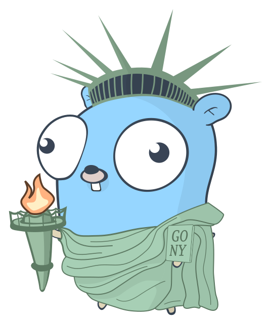

# 06 - Hi-Diddly-Ho



Now that you've written a function to pass a given test, and written a test for a given function, you can probably guess what's coming next. You're going to write both the test, and the function!

**TASK:** Create a file called `hello_test.go`, and write a test called TestHello, just like in previous exercises. Have it call the `Greeting()` function, and expect the result `"Howdy, Gopherinos!"`.

It should fail, because we haven't implemented `Greeting` yet:

```
go test
go build hello: no non-test Go files in exercises/06
FAIL    hello [build failed]
```

**TASK:** Create a `hello.go` file, just like the ones in previous exercises, and implement the `Greeting` function. Once your test passes, check the test again by modifying `Greeting` to return the wrong result, seeing the test fail, and then fixing `Greeting` so it passes again.

## Done?

When your test passes, you're done! Go on to the next exercise:

* [Part of the Package](../07/README.md)

## What's this?

This is one of a set of introductory Go exercises by [John Arundel](https://bitfieldconsulting.com/golang/learn) called [For the Love of Go - Fundamentals](../README.md).

<small>Gopher image by [egonelbre](https://github.com/egonelbre/gophers)</small>