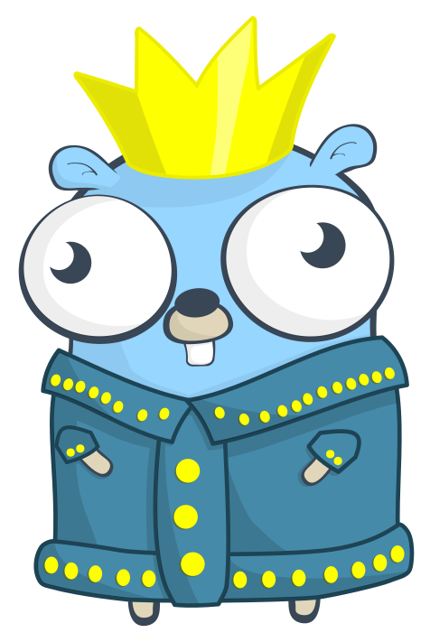

# 07 - Part of the Package



Again, you'll be writing a test and implementing a function to make it pass. There's one extra wrinkle this time. You might have noticed that in the previous exercise directories there's a file called `go.mod`. It looks like this:

```go
module hello

go 1.14
```

What's that for? When you import a package, Go needs to know where to find the source code for that package. The `go.mod` file says "This is the directory where the `hello` package lives." So when you use an import statement like:

```go
import "hello"
```

the `go.mod` file tells Go where to find that package. Whenever you write a Go package, you'll need to create a `go.mod` file to go with it. Luckily, there's an easy way to do that:

```
go mod init hello
```

This will create a `go.mod` file for the package `hello` (or whatever argument you give to `go mod init`.)

**TASK:** Create a `go.mod` file for the `hello` package in this directory.

**TASK:** Write a test for a function in the `hello` package named `ReturnGreeting`. This time, the function must take a string parameter, and it will return a different value depending on that parameter. For example, if we call:

```go
hello.ReturnGreeting("Hi there")
```

we should get the result:

```go
"Hi there yourself!"
```

Just as with the tests in previous exercises, if the result is different from what we expected, the test should fail with an error that shows what was expected and what was actually received. This is much more helpful than a test that simply says something like `Wrong result`, for example.

**TASK:** Once your test is failing satisfactorily, go ahead and implement `ReturnGreeting`, so that the test passes.

## Done?

When your test passes, you're done! Go on to the next exercise:

* [Cold Calculations](../08/README.md)

## What's this?

This is one of a set of introductory Go exercises by [John Arundel](https://bitfieldconsulting.com/golang/learn) called [For the Love of Go - Fundamentals](../README.md).

<small>Gopher image by [egonelbre](https://github.com/egonelbre/gophers)</small>