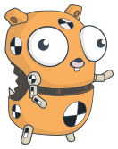

# 08 - Cold Calculations



You're going to implement a simple calculator in Go, as package `calculator`. The first thing we want it to do is add two numbers and return the result, so we'll need a `calculator.Add` function.

To get you started, the `TestAdd` function has already been written:

```go
func TestAdd(t *testing.T) {
	testCases := []struct {
		a, b int
		want int
	}{
		{a: 1, b: 1, want: 2},
		{a: 2, b: 2, want: 4},
		{a: 6, b: 7, want: 13},
	}
	for _, testCase := range testCases {
		got := calculator.Add(testCase.a, testCase.b)
		if testCase.want != got {
			t.Errorf("Add(%d, %d): want %d, got %d", testCase.a, testCase.b, testCase.want, got)
		}
	}
}
```

It looks a bit more complicated than the previous tests we've seen, but that's really only because it tests multiple _cases_. For example, the first case is 1 plus 1, and the result should be 2. The second case is 2 plus 2, and the result should be 4, and so on. Let's see how it works.

We first of all set up the `struct` type for our test case:

```go
struct {
		a, b int
		want int
}
```

This says that test cases (for this test, anyway) will contain two integers `a` and `b`, which are the inputs to the Add function, and another integer `want`, which is the expected result.

Now we go on to supply a slice of test case literals that have this structure:

```go
{
	{a: 1, b: 1, want: 2},
	{a: 2, b: 2, want: 4},
	{a: 6, b: 7, want: 12},
}
```

Having set up our test cases, we then use a `for` loop to go through them one by one:

```go
for _, testCase := range testCases {
	...
}
```

Each time through the loop, the `testCase` variable will contain the test data for each successive case. On the first iteration, `testCase` will be:

```go
{a: 1, b: 1, want: 2}
```

So inside this loop, `testCase.a` and `testCase.b` are the values we want to input to the `Add` function, and `testCase.want` is the value we expect it to return. We call the function and compare the result in just the same way that we did in previous tests:

```go
got := calculator.Add(testCase.a, testCase.b)
if testCase.want != got {
	t.Errorf("Add(%d, %d): want %d, got %d", testCase.a, testCase.b, testCase.want, got)
}
```

So this test is really just the same as every previous test, except we do the test for multiple different inputs and outputs, instead of just one. This is called a _table-driven test_, and it's a very common pattern in Go. Almost all the tests you ever write will look very similar to this, in their basic structure, so it's worth taking a few minutes to make sure you really understand what it's doing.

Once you're happy with this, your job for this exercise is to add some more test cases. When we're thinking up examples to test our functions with, in a sense, we want to think in an _adversarial_ way. We want things that are likely to fail if the function isn't quite correct.

So, for this exercise, you could think of various different kinds of inputs:

* Both negative inputs
* One positive and one negative input
* One input zero, the other negative
* Both inputs zero

**TASK:** Update the test to include a total of five different test cases (that is, five different pairs of inputs and expected results).

**TASK:** Create the `calculator` package and write the `Add` function to make the test pass. You'll need to create a `calculator.go` file and run `go mod init calculator` to create the `go.mod` file declaring this package. Have a look at previous exercises if you're not quite sure how to do this.

**TASK:** Once you've made the test pass, let's make sure the test is really working, by deliberately changing one of the expectations to be wrong. For example, try a test case like this:

```go
{a: 1, b: 1, want: 3}
```

If this doesn't fail, there's something wrong with the test code, isn't there?

Once you've satisfied yourself that the test really tests what you think it does, fix the test cases so that they all pass, and go on to the next exercise.

## Done?

When all your test cases pass, you're done! Go on to the next exercise:

* [Special Operations](../09/README.md)

## What's this?

This is one of a set of introductory Go exercises by [John Arundel](https://bitfieldconsulting.com/golang/learn) called [For the Love of Go - Fundamentals](../README.md).

<small>Gopher image by [egonelbre](https://github.com/egonelbre/gophers)</small>