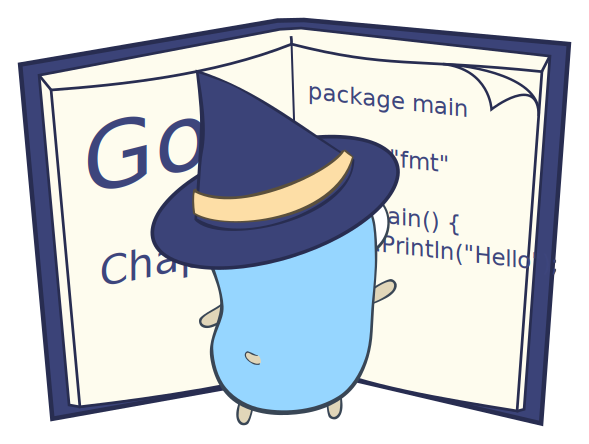

# For the Love of Go: Fundamentals

Hello, and welcome to learning Go! It's great to have you here.

## What's this?

This is a set of introductory exercises in Go programming, suitable for complete beginners. If you don't know anything about Go yet, or programming, but would like to learn, you're in the right place!

(If you do already know something about Go, you should find these exercises relatively straightforward, but still worth doing.)

* [I'm impatient, take me straight to the first exercise](01/README.md)

## What you'll need

You'll need to install Go on your computer, if you don't have it already (if you can run the command `go version` without errors, you're all set!)

Follow the instructions here to download and install Go:

* [https://golang.org/dl/](https://golang.org/dl/)

While all you need to write and run Go programs is a terminal and a text editor, you'll find it very helpful to use an editor which has specific support for Go. For example, [Visual Studio Code](https://code.visualstudio.com/) has excellent Go integration. This video by Francesc Campoy shows some of what it can do:

[ Go Tooling in Action](https://youtu.be/uBjoTxosSys)

## What you'll learn

There's a style of programming (which isn't unique to Go, but is very popular with Go developers) called _Test-Driven Development_ (TDD).

What this means is that before we write a program to do something (multiply two numbers, let's say), we first of all write a _test_.

A test is also a program, but it's a program specifically designed to run _another_ program with various different inputs, and check its result. The test verifies that the program actually behaves the way it's supposed to.

For example, if we were considering writing a function called `Multiply`, and we wanted to be able to check that it worked, we might write a program that calls `Multiply(2, 2)` and checks that the answer is `4`. That's a test!

Lots of programmers use tests, but without necessarily doing TDD. What makes TDD, in particular, so useful, is that we actually write the tests _first_. In most of these exercises, you'll start by writing a test for a particular program, then you'll write the program itself. That might seem backwards to you, but it makes a lot of sense!

By writing the test first, we are forced to think about what the program actually needs to do. We also have to design its interface (the way users interact with the program), since the test interacts with the program the same way a user would. And it also means we know when to stop coding, because when the test starts passing, we're done!

In this set of exercises, you'll learn:

* How to run tests for a Go program
* How to automatically format your Go code correctly
* The basic pattern that all Go tests should follow
* How to declare and import Go _packages_ (units of code)
* How to design multiple _test cases_ and use them in your tests
* How to test error handling in your programs

## If you get stuck

"Show, don't tell" is a really useful principle when teaching people a new skill. If you're used to traditional programming books and training courses, you might be surprised that I don't seem to _tell_ you a whole lot. For example, I won't tell you anything about functions, parameters, return values, data types, loops, strings, and so on. But I'll _show_ you all those things, and I'll never ask you to do something without having already given you an example of it.

So if you get stuck at a certain point and don't know how to do something, the first thing to try is:

* Go back through the current exercises and previous exercises. Is there an example you can copy, paste, and modify to do what you need? If you read all the code carefully, you should find that there is.

Of course learning any new skill involves knowing how to find information yourself. So if you really can't figure out how to do something, Google it!

## How to do the exercises

Start with the first exercise, [Testing Times](01/README.md), read the instructions, and go on from there.

The README for each exercise briefly explains what the exercise is about, and outlines what you'll be doing. Each exercise then has a number of _tasks_ for you to do, marked with **TASK:** in bold.

At the end of each exercise is a section titled **Done?**. This tells you how to check if you've completed the exercise. For example, this section might say "When all the tests pass, you're done!"

## Mentoring

If you are working through these exercises as a GitHub Classroom assignment, or even if you're not, it's helpful to commit and push your changes after each exercise.

This will enable the mentor to review your code right away. You don't need to wait until you've finished all the exercises before submitting your changes.

## Who wrote this?

[John Arundel](https://bitfieldconsulting.com/about) is a Go teacher and mentor of many years experience. He's helped literally thousands of people to learn Go, with friendly, supportive, professional mentoring, and he can help you too! Find out more:

* [Learn Go with mentoring](https://bitfieldconsulting.com/golang/learn)

On with the fun! Let's get started with the first exercise:

* [Testing Times](01/README.md)

<small>Gopher image by [egonelbre](https://github.com/egonelbre/gophers)</small>
